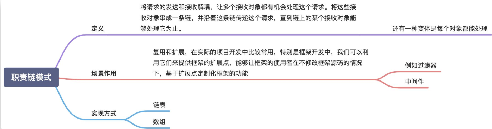

  

  

# 职责链模式

职责链模式的英文翻译是 Chain Of Responsibility Design Pattern。在 GoF 的《设计模式》中，它是这么定义的：
> Avoid coupling the sender of a request to its receiver by giving more than one object a chance to handle the request. Chain the receiving objects and pass the request along the chain until an object handles it.

翻译成中文就是：将请求的发送和接收解耦，让多个接收对象都有机会处理这个请求。将这些接收对象串成一条链，并沿着这条链传递这个请求，直到链上的某个接收对象能够处理它为止。

在职责链模式中，多个处理器（也就是刚刚定义中说的“接收对象”）依次处理同一个请求。一个请求先经过 A 处理器处理，然后再把请求传递给 B 处理器，B 处理器处理完后再传递给 C 处理器，以此类推，形成一个链条。链条上的每个处理器各自承担各自的处理职责，所以叫作职责链模式。

