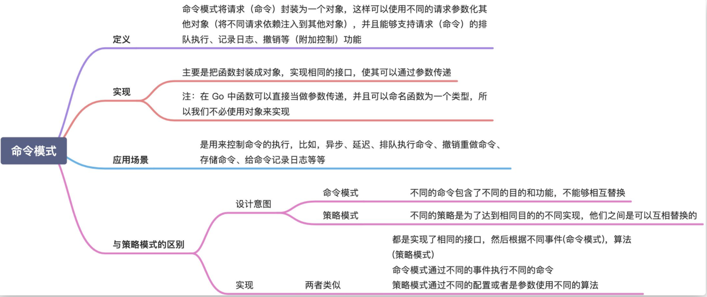
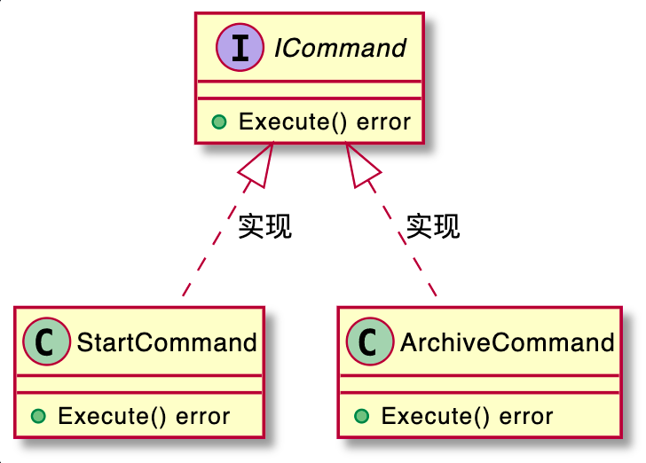

# 命令模式

  

  

命令模式的英文翻译是 Command Design Pattern。在 GoF 的《设计模式》一书中，它是这么定义的：
> The command pattern encapsulates a request as an object, thereby letting us parameterize other objects with different requests, queue or log requests, and support undoable operations.

命令模式将请求（命令）封装为一个对象，这样可以使用不同的请求参数化其他对象（将不同请求依赖注入到其他对象），并且能够支持请求（命令）的排队执行、记录日志、撤销等（附加控制）功能。

落实到编码实现，命令模式用的最核心的实现手段，是将函数封装成对象。我们知道，C 语言支持函数指针，我们可以把函数当作变量传递来传递去。但是，在大部分编程语言中，函数没法儿作为参数传递给其他函数，也没法儿赋值给变量。**借助命令模式，我们可以将函数封装成对象。具体来说就是，设计一个包含这个函数的类，实例化一个对象传来传去，这样就可以实现把函数像对象一样使用。从实现的角度来说，它类似我们之前讲过的回调。**

当我们把函数封装成对象之后，对象就可以存储下来，方便控制执行。所以，命令模式的主要作用和应用场景，是用来控制命令的执行，比如，异步、延迟、排队执行命令、撤销重做命令、存储命令、给命令记录日志等等，这才是命令模式能发挥独一无二作用的地方。