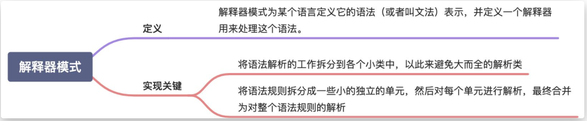
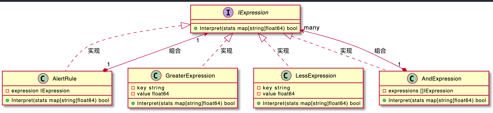

# 编译器模式
  

  

解释器模式的英文翻译是 Interpreter Design Pattern。在 GoF 的《设计模式》一书中，它是这样定义的：
> Interpreter pattern is used to defines a grammatical representation for a language and provides an interpreter to deal with this grammar.

翻译成中文就是：解释器模式为某个语言定义它的语法（或者叫文法）表示，并定义一个解释器用来处理这个语法。

