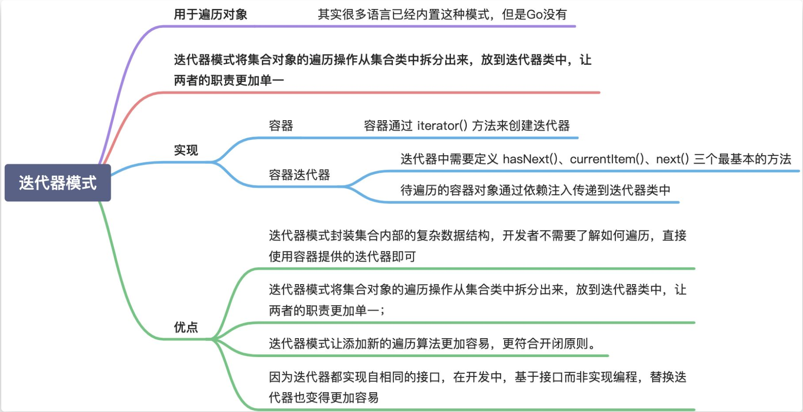
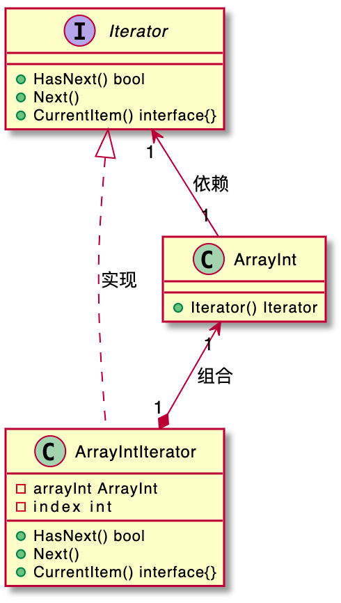
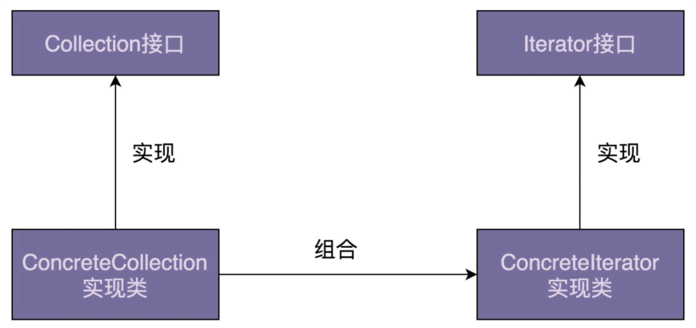
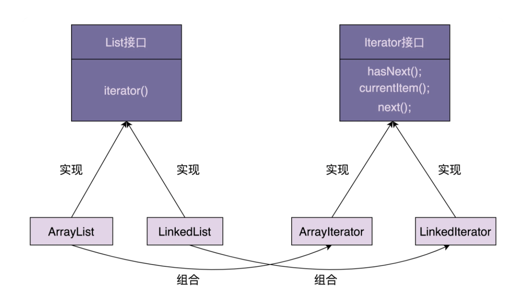

# Iterator
  

  


**迭代器模式主要作用是解耦容器代码和遍历代码**


在开篇中我们讲到，它用来遍历集合对象。这里说的“集合对象”也可以叫“容器”“聚合对象”，实际上就是包含一组对象的对象，比如数组、链表、树、图、跳表。迭代器模式将集合对象的遍历操作从集合类中拆分出来，放到迭代器类中，让两者的职责更加单一。

  

以arraylist，linklist为🌰：将list迭代器的创建过程放入arraylist内。返回一个iterator的接口。对于迭代器而言，arrarylist依赖注入到自己的内部。
  

# 为什么要使用迭代器
```
List<String> names = new ArrayList<>();
names.add("xzg");
names.add("wang");
names.add("zheng");

// 第一种遍历方式：for循环
for (int i = 0; i < names.size(); i++) {
  System.out.print(names.get(i) + ",");
}

// 第二种遍历方式：foreach循环
for (String name : names) {
  System.out.print(name + ",")
}

// 第三种遍历方式：迭代器遍历
Iterator<String> iterator = names.iterator();
while (iterator.hasNext()) {
  System.out.print(iterator.next() + ",");//Java中的迭代器接口是第二种定义方式，next()既移动游标又返回数据
}
```

首先，对于类似数组和链表这样的数据结构，遍历方式比较简单，直接使用 for 循环来遍历就足够了。但是，对于复杂的数据结构（比如树、图）来说，有各种复杂的遍历方式。比如，树有前中后序、按层遍历，图有深度优先、广度优先遍历等等。如果由客户端代码来实现这些遍历算法，势必增加开发成本，而且容易写错。如果将这部分遍历的逻辑写到容器类中，也会导致容器类代码的复杂性。

其次，**将游标指向的当前位置等信息，存储在迭代器类中，每个迭代器独享游标信息**。这样，我们就可以创建多个不同的迭代器，同时对同一个容器进行遍历而互不影响。

# 如何应对遍历时改变集合导致的未决行为？

新增一个field modCount，当调用修改array的接口，就增加一次modCount。当运行迭代器之前 modCount赋值给expectedModCount，运行结束if modCount != expectedModCount, 那就抛出异常。

怎么确定在遍历时候，集合有没有增删元素呢？我们在 ArrayList 中定义一个成员变量 modCount，记录集合被修改的次数，集合每调用一次增加或删除元素的函数，就会给 modCount 加 1。当通过调用集合上的 iterator() 函数来创建迭代器的时候，我们把 modCount 值传递给迭代器的 expectedModCount 成员变量，之后每次调用迭代器上的 hasNext()、next()、currentItem() 函数，我们都会检查集合上的 modCount 是否等于 expectedModCount，也就是看，在创建完迭代器之后，modCount 是否改变过。

# 支持快照迭代器
1. 第一种方法，就是存入迭代器的是一个浅拷贝对象
2. 为每一个元素新增addTimestamp，deleteTimestamp，当创建迭代器的时候就有一个snipTimestamp， addTimestamp < snipTimestamp < deleteTimestamp 就是这个迭代器遍历到的元素。此时并不支持了下标方式的随机访问，为了支持可以再创建一个正常数组，支持随机访问。
