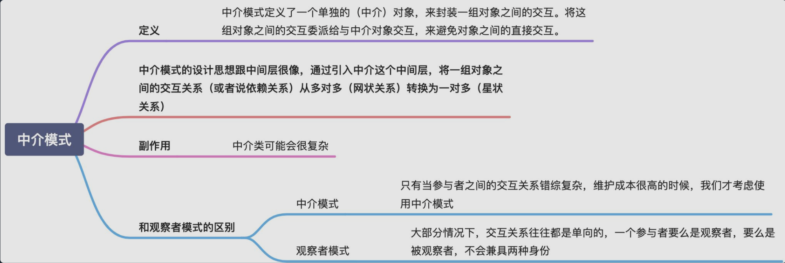
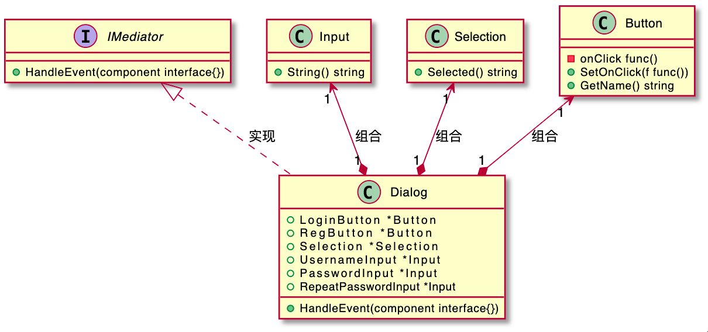
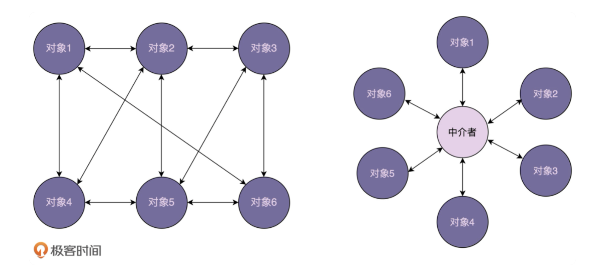

# 中介模式

  

  

中介模式的英文翻译是 Mediator Design Pattern。在 GoF 中的《设计模式》一书中，它是这样定义的：
> Mediator pattern defines a separate (mediator) object that encapsulates the interaction between a set of objects and the objects delegate their interaction to a mediator object instead of interacting with each other directly.

翻译成中文就是：中介模式定义了一个单独的（中介）对象，来封装一组对象之间的交互。将这组对象之间的交互委派给与中介对象交互，来避免对象之间的直接交互。

实际上，中介模式的设计思想跟中间层很像，通过引入中介这个中间层，将一组对象之间的交互关系（或者说依赖关系）从多对多（网状关系）转换为一对多（星状关系）。原来一个对象要跟 n 个对象交互，现在只需要跟一个中介对象交互，从而最小化对象之间的交互关系，降低了代码的复杂度，提高了代码的可读性和可维护性。
  

中介模式的设计思想跟中间层很像，通过引入中介这个中间层，将一组对象之间的交互关系（或者依赖关系）从多对多（网状关系）转换为一对多（星状关系）。原来一个对象要跟 n 个对象交互，现在只需要跟一个中介对象交互，从而最小化对象之间的交互关系，降低了代码的复杂度，提高了代码的可读性和可维护性。

观察者模式和中介模式都是为了实现参与者之间的解耦，简化交互关系。两者的不同在于应用场景上。在观察者模式的应用场景中，参与者之间的交互比较有条理，一般都是单向的，一个参与者只有一个身份，要么是观察者，要么是被观察者。而在中介模式的应用场景中，参与者之间的交互关系错综复杂，既可以是消息的发送者、也可以同时是消息的接收者。