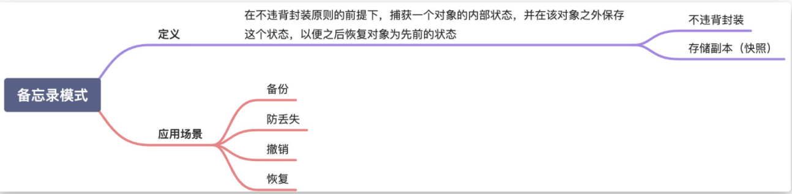
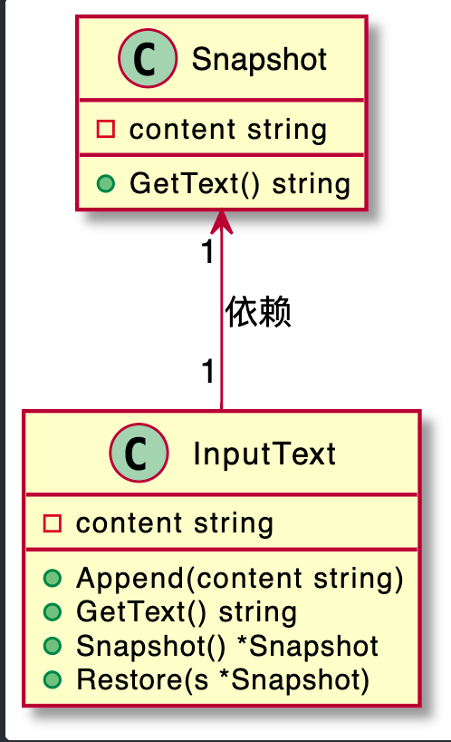

# 备忘录模式

  

  

备忘录模式，也叫快照（Snapshot）模式，英文翻译是 Memento Design Pattern。在 GoF 的《设计模式》一书中，备忘录模式是这么定义的：
> Captures and externalizes an object’s internal state so that it can be restored later, all without violating encapsulation.

翻译成中文就是：在不违背封装原则的前提下，捕获一个对象的内部状态，并在该对象之外保存这个状态，以便之后恢复对象为先前的状态。

备忘录模式也叫快照模式，具体来说，就是在不违背封装原则的前提下，捕获一个对象的内部状态，并在该对象之外保存这个状态，以便之后恢复对象为先前的状态。这个模式的定义表达了两部分内容：一部分是，存储副本以便后期恢复；另一部分是，要在不违背封装原则的前提下，进行对象的备份和恢复。

备忘录模式的应用场景也比较明确和有限，主要是用来防丢失、撤销、恢复等。它跟平时我们常说的“备份”很相似。两者的主要区别在于，备忘录模式更侧重于代码的设计和实现，备份更侧重架构设计或产品设计。

对于大对象的备份来说，备份占用的存储空间会比较大，备份和恢复的耗时会比较长。针对这个问题，不同的业务场景有不同的处理方式。比如，只备份必要的恢复信息，结合最新的数据来恢复；再比如，全量备份和增量备份相结合，低频全量备份，高频增量备份，两者结合来做恢复。