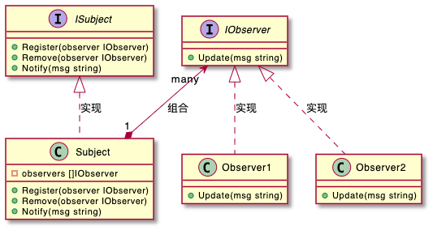

# 观察者模式 / 发布订阅模式

今天，我们学习第一个行为型设计模式，也是在实际的开发中用得比较多的一种模式：观察者模式。**根据应用场景的不同，观察者模式会对应不同的代码实现方式：有同步阻塞的实现方式，也有异步非阻塞的实现方式；有进程内的实现方式，也有跨进程的实现方式**。

> Define a one-to-many dependency between objects so that when one object changes state, all its dependents are notified and updated automatically.

翻译成中文就是：在对象之间定义一个一对多的依赖，当一个对象状态改变的时候，所有依赖的对象都会自动收到通知。

  

---
UML: 同步模型
  

UML: 异步模型
  
