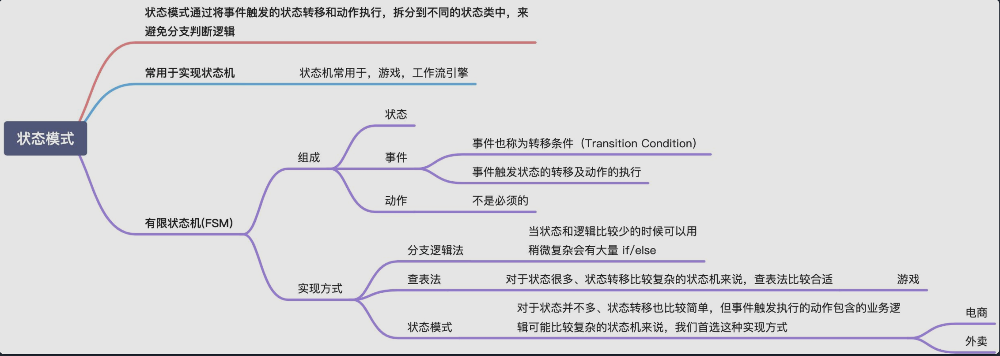
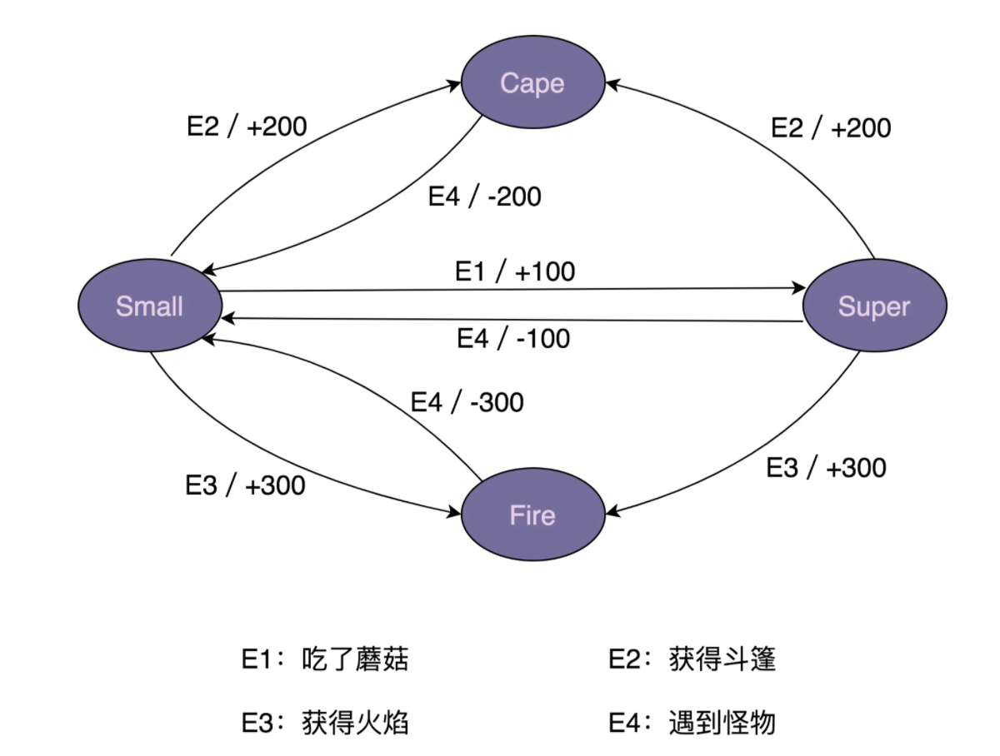
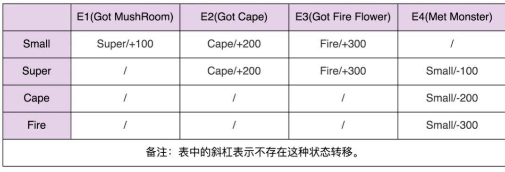

# 状态模式
  

# 什么是有限状态机？
有限状态机，英文翻译是 Finite State Machine，**缩写为 FSM，简称为状态机**。状态机有 3 个组成部分：状态（State）、事件（Event）、动作（Action）。其中，事件也称为转移条件（Transition Condition）。事件触发状态的转移及动作的执行。不过，动作不是必须的，也可能只转移状态，不执行任何动作。

🌰超级马里奥状态机：
  

定义骨架:
```
public enum State {
  SMALL(0),
  SUPER(1),
  FIRE(2),
  CAPE(3);

  private int value;

  private State(int value) {
    this.value = value;
  }

  public int getValue() {
    return this.value;
  }
}

public class MarioStateMachine {
  private int score;
  private State currentState;

  public MarioStateMachine() {
    this.score = 0;
    this.currentState = State.SMALL;
  }

  public void obtainMushRoom() {
    //TODO
  }

  public void obtainCape() {
    //TODO
  }

  public void obtainFireFlower() {
    //TODO
  }

  public void meetMonster() {
    //TODO
  }

  public int getScore() {
    return this.score;
  }

  public State getCurrentState() {
    return this.currentState;
  }
}

public class ApplicationDemo {
  public static void main(String[] args) {
    MarioStateMachine mario = new MarioStateMachine();
    mario.obtainMushRoom();
    int score = mario.getScore();
    State state = mario.getCurrentState();
    System.out.println("mario score: " + score + "; state: " + state);
  }
}
```

# 状态机的实现方法一：分支逻辑法
最简单直接的实现方式是，参照状态转移图，将每一个状态转移，原模原样地直译成代码。

对于简单的状态机来说，分支逻辑这种实现方式是可以接受的。但是，对于复杂的状态机来说，**这种实现方式极易漏写或者错写某个状态转移**。除此之外，代码中充斥着大量的 if-else 或者 switch-case 分支判断逻辑，可读性和可维护性都很差。如果哪天修改了状态机中的某个状态转移，我们要在冗长的分支逻辑中找到对应的代码进行修改，很容易改错，引入 bug。
```
public class MarioStateMachine {
  private int score;
  private State currentState;

  public MarioStateMachine() {
    this.score = 0;
    this.currentState = State.SMALL;
  }

  public void obtainMushRoom() {
    if (currentState.equals(State.SMALL)) {
      this.currentState = State.SUPER;
      this.score += 100;
    }
  }

  public void obtainCape() {
    if (currentState.equals(State.SMALL) || currentState.equals(State.SUPER) ) {
      this.currentState = State.CAPE;
      this.score += 200;
    }
  }

  public void obtainFireFlower() {
    if (currentState.equals(State.SMALL) || currentState.equals(State.SUPER) ) {
      this.currentState = State.FIRE;
      this.score += 300;
    }
  }

  public void meetMonster() {
    if (currentState.equals(State.SUPER)) {
      this.currentState = State.SMALL;
      this.score -= 100;
      return;
    }

    if (currentState.equals(State.CAPE)) {
      this.currentState = State.SMALL;
      this.score -= 200;
      return;
    }

    if (currentState.equals(State.FIRE)) {
      this.currentState = State.SMALL;
      this.score -= 300;
      return;
    }
  }

  public int getScore() {
    return this.score;
  }

  public State getCurrentState() {
    return this.currentState;
  }
}
```

# 状态机实现方式二：查表法
实际上，除了用状态转移图来表示之外，状态机还可以用二维表来表示，如下所示。在这个二维表中，第一维表示当前状态，第二维表示事件，值表示当前状态经过事件之后，转移到的新状态及其执行的动作。

  

**当修改状态机时，我们只需要修改 transitionTable 和 actionTable 两个二维数组即可。实际上，如果我们把这两个二维数组存储在配置文件中，当需要修改状态机时，我们甚至可以不修改任何代码，只需要修改配置文件就可以了。**
```
public enum Event {
  GOT_MUSHROOM(0),
  GOT_CAPE(1),
  GOT_FIRE(2),
  MET_MONSTER(3);

  private int value;

  private Event(int value) {
    this.value = value;
  }

  public int getValue() {
    return this.value;
  }
}

public class MarioStateMachine {
  private int score;
  private State currentState;

  private static final State[][] transitionTable = {
          {SUPER, CAPE, FIRE, SMALL},
          {SUPER, CAPE, FIRE, SMALL},
          {CAPE, CAPE, CAPE, SMALL},
          {FIRE, FIRE, FIRE, SMALL}
  };

  private static final int[][] actionTable = {
          {+100, +200, +300, +0},
          {+0, +200, +300, -100},
          {+0, +0, +0, -200},
          {+0, +0, +0, -300}
  };

  public MarioStateMachine() {
    this.score = 0;
    this.currentState = State.SMALL;
  }

  public void obtainMushRoom() {
    executeEvent(Event.GOT_MUSHROOM);
  }

  public void obtainCape() {
    executeEvent(Event.GOT_CAPE);
  }

  public void obtainFireFlower() {
    executeEvent(Event.GOT_FIRE);
  }

  public void meetMonster() {
    executeEvent(Event.MET_MONSTER);
  }

  private void executeEvent(Event event) {
    int stateValue = currentState.getValue();
    int eventValue = event.getValue();
    this.currentState = transitionTable[stateValue][eventValue];
    this.score += actionTable[stateValue][eventValue];
  }

  public int getScore() {
    return this.score;
  }

  public State getCurrentState() {
    return this.currentState;
  }

}
```

# 状态机实现方式三：状态模式
在查表法的代码实现中，事件触发的动作只是简单的积分加减，所以，我们用一个 int 类型的二维数组 actionTable 就能表示，二维数组中的值表示积分的加减值, 没办法表示一系列复杂的状态。

状态模式通过将事件触发的状态转移和动作执行，拆分到不同的状态类中，来避免分支判断逻辑。我们还是结合代码来理解这句话。


实际上，**像游戏这种比较复杂的状态机，包含的状态比较多，我优先推荐使用查表法**，而状态模式会引入非常多的状态类，会导致代码比较难维护。**相反，像电商下单、外卖下单这种类型的状态机，它们的状态并不多，状态转移也比较简单，但事件触发执行的动作包含的业务逻辑可能会比较复杂，所以，更加推荐使用状态模式来实现**。


```
public interface IMario {
  State getName();
  void obtainMushRoom(MarioStateMachine stateMachine);
  void obtainCape(MarioStateMachine stateMachine);
  void obtainFireFlower(MarioStateMachine stateMachine);
  void meetMonster(MarioStateMachine stateMachine);
}

public class SmallMario implements IMario {
  private static final SmallMario instance = new SmallMario();
  private SmallMario() {}
  public static SmallMario getInstance() {
    return instance;
  }

  @Override
  public State getName() {
    return State.SMALL;
  }

  @Override
  public void obtainMushRoom(MarioStateMachine stateMachine) {
    stateMachine.setCurrentState(SuperMario.getInstance());
    stateMachine.setScore(stateMachine.getScore() + 100);
  }

  @Override
  public void obtainCape(MarioStateMachine stateMachine) {
    stateMachine.setCurrentState(CapeMario.getInstance());
    stateMachine.setScore(stateMachine.getScore() + 200);
  }

  @Override
  public void obtainFireFlower(MarioStateMachine stateMachine) {
    stateMachine.setCurrentState(FireMario.getInstance());
    stateMachine.setScore(stateMachine.getScore() + 300);
  }

  @Override
  public void meetMonster(MarioStateMachine stateMachine) {
    // do nothing...
  }
}

// 省略SuperMario、CapeMario、FireMario类...

public class MarioStateMachine {
  private int score;
  private IMario currentState;

  public MarioStateMachine() {
    this.score = 0;
    this.currentState = SmallMario.getInstance();
  }

  public void obtainMushRoom() {
    this.currentState.obtainMushRoom(this);
  }

  public void obtainCape() {
    this.currentState.obtainCape(this);
  }

  public void obtainFireFlower() {
    this.currentState.obtainFireFlower(this);
  }

  public void meetMonster() {
    this.currentState.meetMonster(this);
  }

  public int getScore() {
    return this.score;
  }

  public State getCurrentState() {
    return this.currentState.getName();
  }

  public void setScore(int score) {
    this.score = score;
  }

  public void setCurrentState(IMario currentState) {
    this.currentState = currentState;
  }
}
```