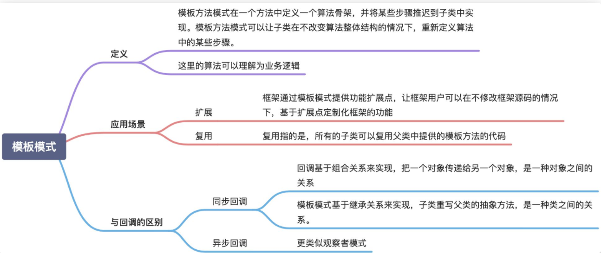
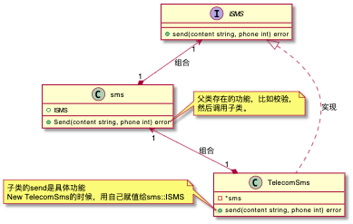

- [模版模式](#模版模式)
- [模板模式 VS 回调](#模板模式-vs-回调)
- [Go代码的实现](#go代码的实现)
---
  
---
  

# 模版模式
模板模式主要是用来解决复用和扩展两个问题

模板模式，全称是模板方法设计模式，英文是 Template Method Design Pattern。在 GoF 的《设计模式》一书中，它是这么定义的：
> Define the skeleton of an algorithm in an operation, deferring some steps to subclasses. Template Method lets subclasses redefine certain steps of an algorithm without changing the algorithm's structure.

翻译成中文就是：模板方法模式在一个方法中定义一个算法骨架，并将某些步骤推迟到子类中实现。模板方法模式可以让子类在不改变算法整体结构的情况下，重新定义算法中的某些步骤。

这里的“算法”，我们可以理解为广义上的“业务逻辑”，并不特指数据结构和算法中的“算法”。这里的算法骨架就是“模板”，包含算法骨架的方法就是“模板方法”，这也是模板方法模式名字的由来。

模板模式有两大作用：复用和扩展。其中，**复用指的是，所有的子类可以复用父类中提供的模板方法的代码。扩展指的是，框架通过模板模式提供功能扩展点，让框架用户可以在不修改框架源码的情况下，基于扩展点定制化框架的功能**。

**复用和扩展**是模板模式的两大作用，实际上，还有另外一个技术概念，也能起到跟模板模式相同的作用，那就是**回调**（Callback）。今天我们今天就来看一下，回调的原理、实现和应用，以及它跟模板模式的区别和联系。

从应用场景上来看，同步回调看起来更像模板模式，异步回调看起来更像观察者模式。

# 模板模式 VS 回调
从应用场景上来看，同步回调跟模板模式几乎一致。它们都是在一个大的算法骨架中，自由替换其中的某个步骤，起到代码复用和扩展的目的。而异步回调跟模板模式有较大差别，更像是观察者模式。

从代码实现上来看，回调和模板模式完全不同。回调基于组合关系来实现，把一个对象传递给另一个对象，是一种对象之间的关系；模板模式基于继承关系来实现，子类重写父类的抽象方法，是一种类之间的关系。

前面我们也讲到，组合优于继承。实际上，这里也不例外。在代码实现上，回调相对于模板模式会更加灵活，主要体现在下面几点。
- 像 Java 这种只支持单继承的语言，基于模板模式编写的子类，已经继承了一个父类，不再具有继承的能力。
- 回调可以使用匿名类来创建回调对象，可以不用事先定义类；而模板模式针对不同的实现都要定义不同的子类。
- 如果某个类中定义了多个模板方法，每个方法都有对应的抽象方法，那即便我们只用到其中的一个模板方法，子类也必须实现所有的抽象方法。而回调就更加灵活，我们只需要往用到的模板方法中注入回调对象即可。

# Go代码的实现
举个 🌰，假设我现在要做一个短信推送的系统，那么需要。
1. 检查短信字数是否超过限制
2. 检查手机号是否正确
3. 发送短信
4. 返回状态

我们可以发现，在发送短信的时候由于不同的供应商调用的接口不同，所以会有一些实现上的差异，但是他的算法（业务逻辑）是固定的

