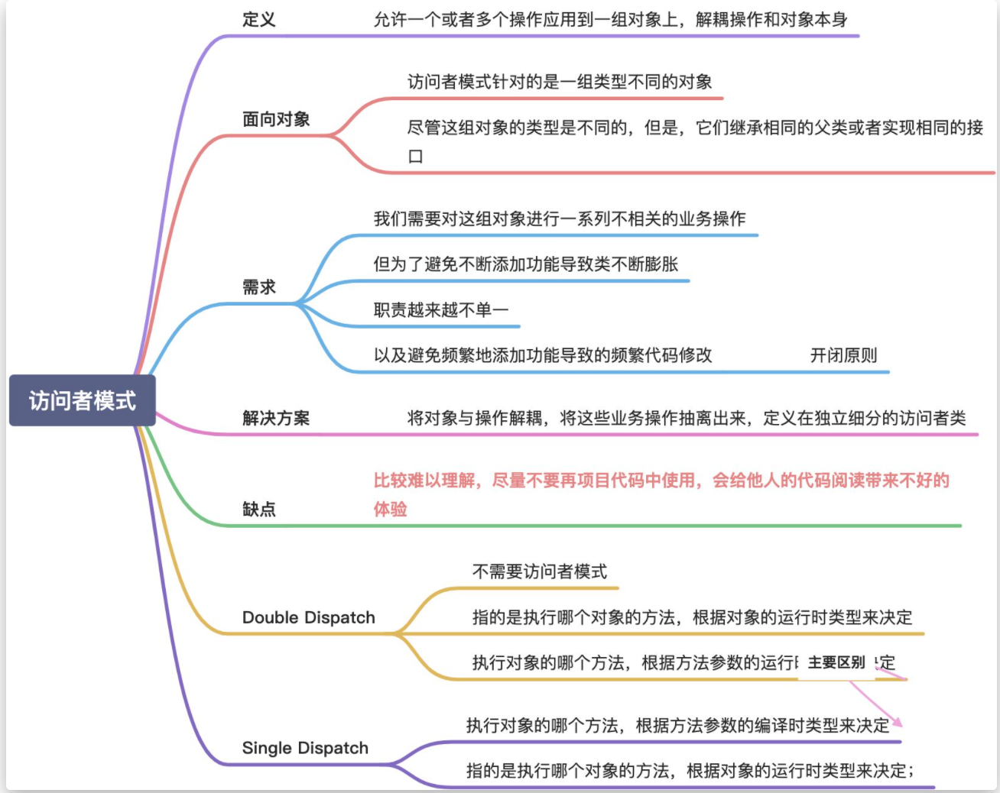
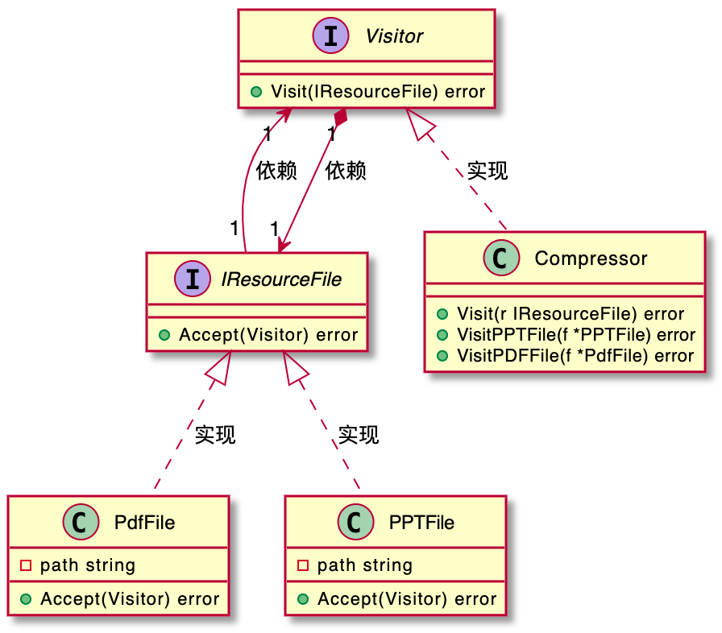
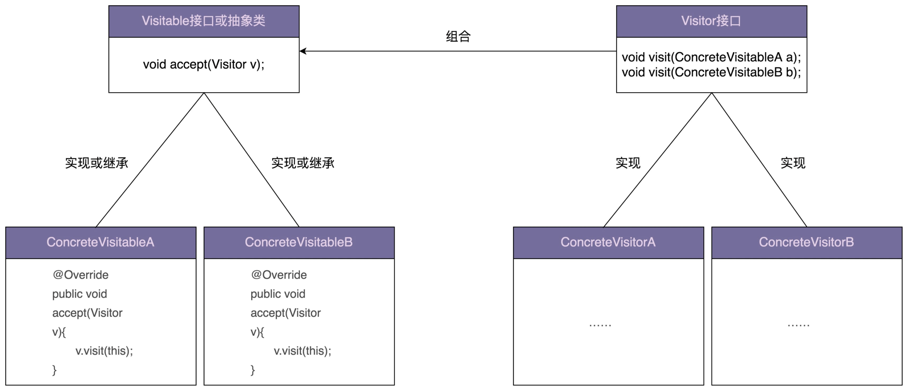

# 访问者模式
  

  


**注意由于没有函数重载，所以我们并不知道传递过来的对象是什么类型，这个时候只能采用类型断言的方式来对不同的类型做不同的操作，但是正式由于没有函数重载，所以其实完全可以不用访问者模式直接传入参数就好了。**

访问者模式允许一个或者多个操作应用到一组对象上，**设计意图是解耦操作和对象本身，保持类职责单一、满足开闭原则以及应对代码的复杂性**。

---


访问者模式针对的是一组类型不同的对象（PdfFile、PPTFile、WordFile）。不过，**尽管这组对象的类型是不同的，但是，它们继承相同的父类（ResourceFile）或者实现相同的接口**。在不同的应用场景下，我们需要对这组对象进行一系列不相关的业务操作（抽取文本、压缩等），但为了避免不断添加功能导致类（PdfFile、PPTFile、WordFile）不断膨胀，职责越来越不单一，以及**避免频繁地添加功能导致的频繁代码修改，我们使用访问者模式，将对象与操作解耦，将这些业务操作抽离出来，定义在独立细分的访问者类（Extractor、Compressor）中**。

  


对于访问者模式，学习的主要难点在代码实现。而代码实现比较复杂的主要原因是，函数重载在大部分面向对象编程语言中是静态绑定的。也就是说，调用类的哪个重载函数，是在编译期间，由参数的声明类型决定的，而非运行时，根据参数的实际类型决定的。

**正是因为代码实现难理解，所以，在项目中应用这种模式，会导致代码的可读性比较差。如果你的同事不了解这种设计模式，可能就会读不懂、维护不了你写的代码。所以，除非不得已，不要使用这种模式。**

访问者模式解决的痛点主要是需要动态绑定的类型，所以调用哪个重载版本，其参数中的子类必须传入静态类型为目标子类的参数，并在方法中使用传入参数的动态绑定。如果不使用访问者模式，可以使用策略模式，使用工厂模式在map中保存type和具体子类实例的映射，在使用的时候，根据type的不同调用不同子类的方法（动态绑定）。

# 为什么支持双分派的语言不需要访问者模式？
多态只是根据类型不同，在运行态时确认具体执行哪个函数。但是重载函数是静态的，并不能在运行态确认执行哪个，所以java，c++，go都是需要访问者模式来完成双分派。


# 除了访问者模式，上一节的例子还有其他实现方案吗？

对于资源文件处理工具这个例子，如果工具提供的功能并不是非常多，只有几个而已，那我更推荐使用工厂模式的实现方式，毕竟代码更加清晰、易懂。相反，如果工具提供非常多的功能，比如有十几个，那我更推荐使用访问者模式，因为访问者模式需要定义的类要比工厂模式的实现方式少很多，类太多也会影响到代码的可维护性。

```

public abstract class ResourceFile {
  protected String filePath;
  public ResourceFile(String filePath) {
    this.filePath = filePath;
  }
  public abstract ResourceFileType getType();
}

public class PdfFile extends ResourceFile {
  public PdfFile(String filePath) {
    super(filePath);
  }

  @Override
  public ResourceFileType getType() {
    return ResourceFileType.PDF;
  }

  //...
}

//...PPTFile/WordFile跟PdfFile代码结构类似，此处省略...

public interface Extractor {
  void extract2txt(ResourceFile resourceFile);
}

public class PdfExtractor implements Extractor {
  @Override
  public void extract2txt(ResourceFile resourceFile) {
    //...
  }
}

//...PPTExtractor/WordExtractor跟PdfExtractor代码结构类似，此处省略...

public class ExtractorFactory {
  private static final Map<ResourceFileType, Extractor> extractors = new HashMap<>();
  static {
    extractors.put(ResourceFileType.PDF, new PdfExtractor());
    extractors.put(ResourceFileType.PPT, new PPTExtractor());
    extractors.put(ResourceFileType.WORD, new WordExtractor());
  }

  public static Extractor getExtractor(ResourceFileType type) {
    return extractors.get(type);
  }
}

public class ToolApplication {
  public static void main(String[] args) {
    List<ResourceFile> resourceFiles = listAllResourceFiles(args[0]);
    for (ResourceFile resourceFile : resourceFiles) {
      Extractor extractor = ExtractorFactory.getExtractor(resourceFile.getType());
      extractor.extract2txt(resourceFile);
    }
  }

  private static List<ResourceFile> listAllResourceFiles(String resourceDirectory) {
    List<ResourceFile> resourceFiles = new ArrayList<>();
    //...根据后缀(pdf/ppt/word)由工厂方法创建不同的类对象(PdfFile/PPTFile/WordFile)
    resourceFiles.add(new PdfFile("a.pdf"));
    resourceFiles.add(new WordFile("b.word"));
    resourceFiles.add(new PPTFile("c.ppt"));
    return resourceFiles;
  }
}
```