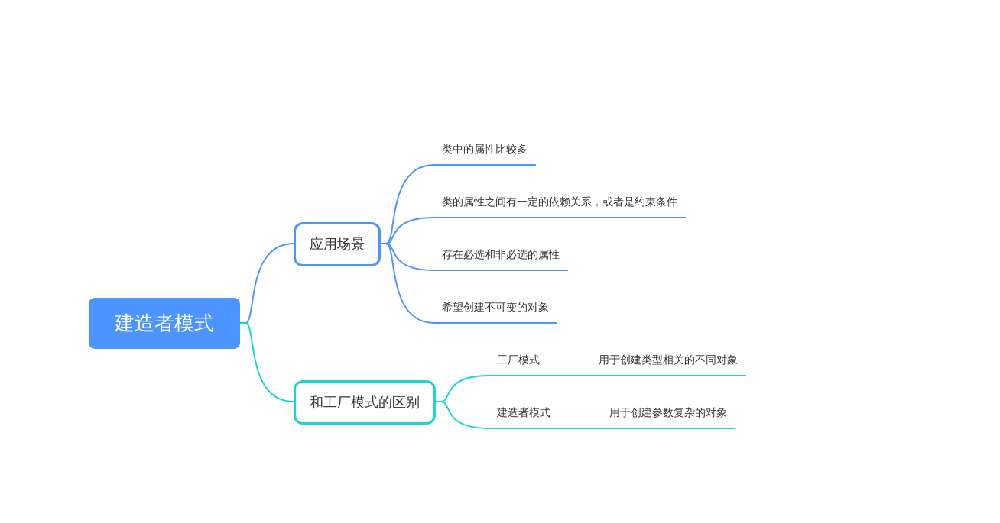

# 建造者模式
Builder模式：建造者模式，构建者模式，或叫生成器模式

> 我们把类的必填属性放到构造函数中，强制创建对象的时候就设置。如果必填的属性有很多，把这些必填属性都放到构造函数中设置，那构造函数就又会出现参数列表很长的问题。如果我们把必填属性通过 set() 方法设置，那校验这些必填属性是否已经填写的逻辑就无处安放了。
>
>如果类的属性之间有一定的依赖关系或者约束条件，我们继续使用构造函数配合 set() 方法的设计思路，那这些依赖关系或约束条件的校验逻辑就无处安放了。
>
>如果我们希望创建不可变对象，也就是说，对象在创建好之后，就不能再修改内部的属性值，要实现这个功能，我们就不能在类中暴露 set() 方法。构造函数配合 set() 方法来设置属性值的方式就不适用了。

