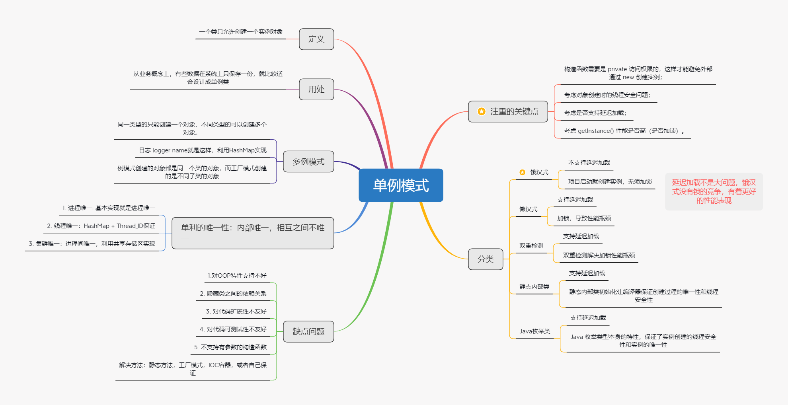

# 模式名称
单例模式

# 环境和问题
在一个系统运行期间，某个类只需要一个类实例就行，该如何实现？

# 解决方案
单例模式的定义：保证一个类仅有一个实例，提供一个访问它的全局访问点。
UML设计图：

   

# 本质

单例模式采用了 饿汉式 和 懒汉式 两种实现，个人其实更倾向于饿汉式的实现，简单，并且可以将问题及早暴露，懒汉式虽然支持延迟加载，但是这只是把冷启动时间放到了第一次使用的时候，并没有本质上解决问题，并且为了实现懒汉式还不可避免的需要加锁
