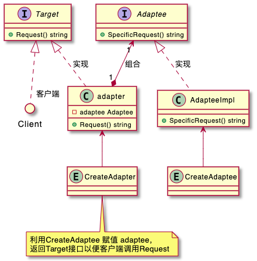
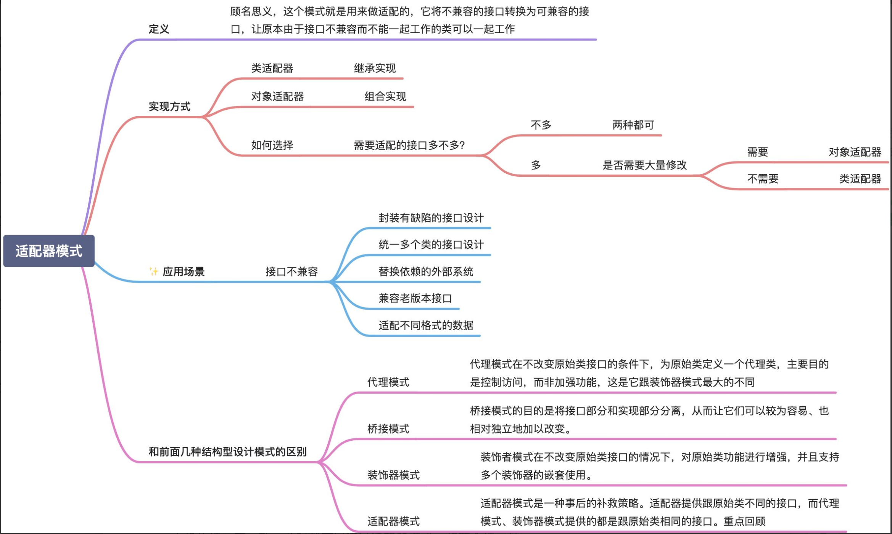
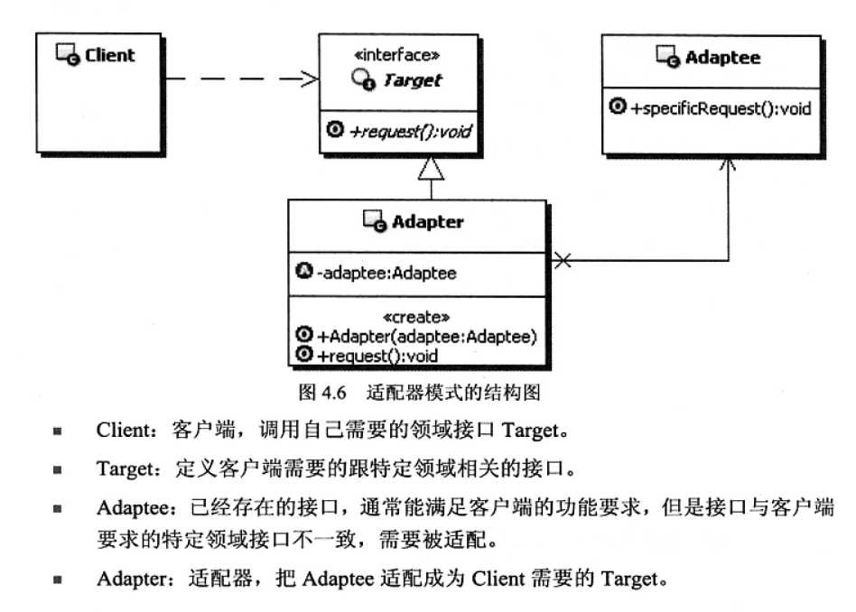
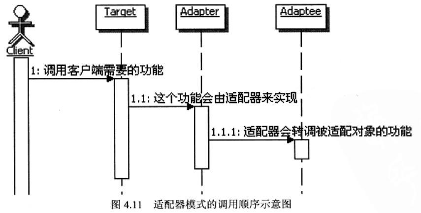
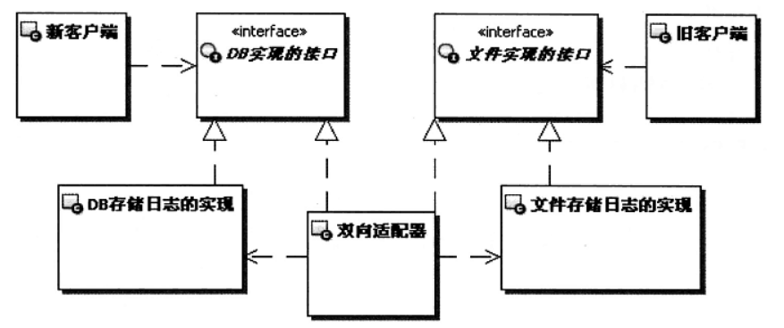
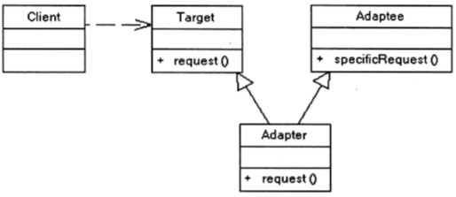

- [模式名称](#模式名称)
- [环境和问题](#环境和问题)
- [解决方案](#解决方案)
- [模式详解](#模式详解)
- [优缺点](#优缺点)

# 模式名称
适配器模式(转接器)

  

  

# 环境和问题
**生活的问题：**
- 适配器的精髓就在转接器上，生活中例如显示屏的转接线，硬盘的转接线，显卡的转接器等等。

**开发的问题：**
- 同时支持数据库与文件的日志系统

这里都是原先的接口无法匹配，需要用一层转接器使双方的接口完全匹配。

# 解决方案
>将一个类的接口转换成客户希望的另一个接口。适配器模式使得原本接口不兼容的类可以一起工作

**UML实现图：**
    
   

# 模式详解
1. 模式的功能：复用已有的功能适配新的接口，将不兼容的接口适配为客户端期望的样子。
2. Adaptee和Target的关系：需要适配的接口Adaptee与适配成为的接口Target是没有关联的
3. 对象组合：适配器利用对象组合适配需要适配的对象。当客户端调用Target，适配器负责委派给被适配的对象
4. 适配器模式调用的顺序：
    
    
5. 常见实现：让适配器类实现Target接口，然后在适配器的具体实现里调用Adaptee
6. 智能适配器：适配器实现一些Adaptee不具有的功能，可以是Adaptee方法组合的更高级别功能，也可以实现新的扩展功能
7. 适配多个Adaptee：在实现Target功能时，需要调用多个Adaptee
8. 适配器Adaptee的复杂程度：取决于Target与Adaptee的相似度
9. 缺省适配：为Target提供缺省实现，有了它可以采用继承这个缺省适配对象，从而让子类有选择地覆盖实现
10. 双向适配器：Adaptee适配为Target，也可以将Target适配为Adaptee p65页
    
    
11. 对象适配器和类适配器
    - 对象适配器：依赖对象组合
    - 类适配器：采用多重继承对一个接口与另一个接口进行匹配
        
        
    - 类适配器是静态的定义方式，可以重定义Adaptee的部分行为，对象适配器是动态组合，需要定义Adaptee的子类实现重定义然后再组合子类

# 优缺点
> 转换匹配，复用功能

优点：
1. 更好的复用性
2. 更好的可扩展性：实现适配器功能可以调用自己开发的功能

缺点：
1. 过多的使用适配器，会使系统非常零乱，不容易整体进行把握。