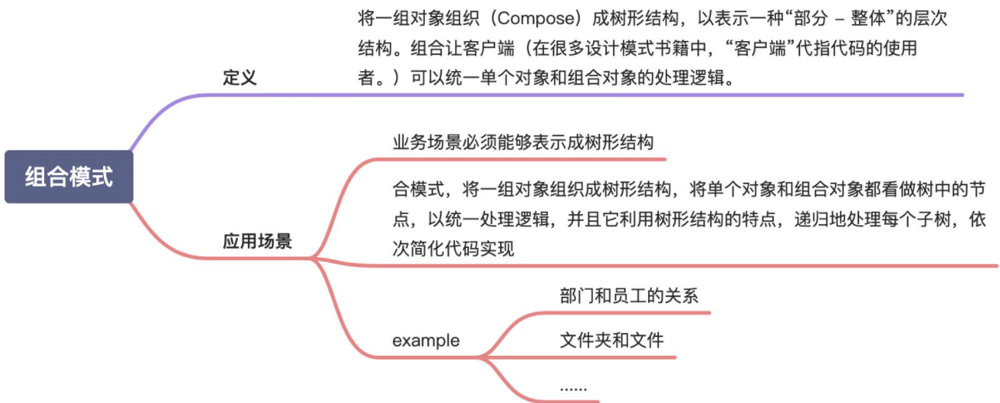

# 组合模式

  

这里讲的“组合模式”，主要是用来处理树形结构数据。这里的“数据”，你可以简单理解为一组对象集合。

>Compose objects into tree structure to represent part-whole hierarchies.Composite lets client treat individual objects and compositions of objects uniformly.

翻译成中文就是：将一组对象组织（Compose）成树形结构，以表示一种“部分 - 整体”的层次结构。组合让客户端（在很多设计模式书籍中，“客户端”代指代码的使用者。）可以统一单个对象和组合对象的处理逻辑。

假设我们有这样一个需求：设计一个类来表示文件系统中的目录，能方便地实现下面这些功能：
1. 动态地添加、删除某个目录下的子目录或文件；
2. 统计指定目录下的文件个数；
3. 统计指定目录下的文件总大小。

