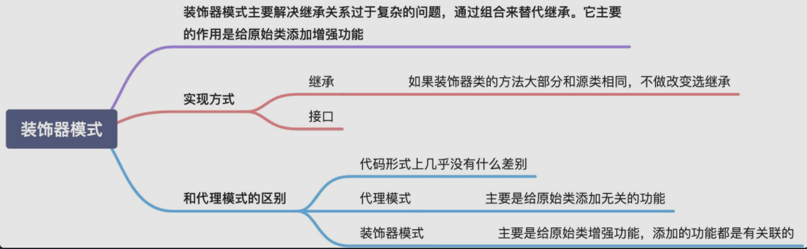

# 装饰器模式
  

装饰器模式主要解决继承关系过于复杂的问题，**通过组合来替代继承**。它主要的作用是给原始类添加增强功能。这也是判断是否该用装饰器模式的一个重要的依据。除此之外，装饰器模式还有一个特点，那就是可以对原始类嵌套使用多个装饰器。为了满足这个应用场景，在设计的时候，装饰器类需要跟原始类继承相同的抽象类或者接口

1. 装饰器类和原始类继承同样的父类，这样我们可以对原始类“嵌套”多个装饰器类。
2. 代理类附加的是跟原始类无关的功能，而在装饰器模式中，装饰器类附加的是跟原始类相关的增强功能。

