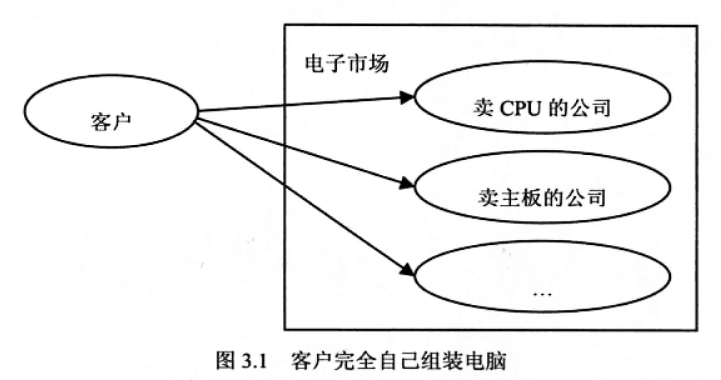
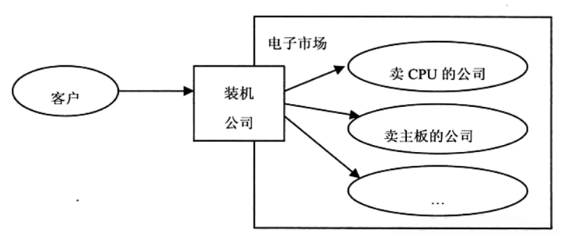
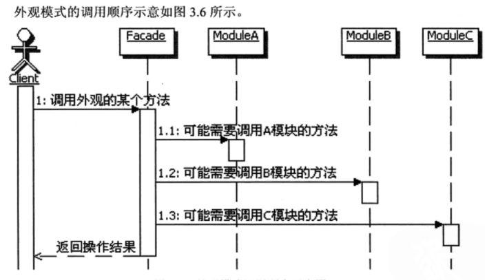
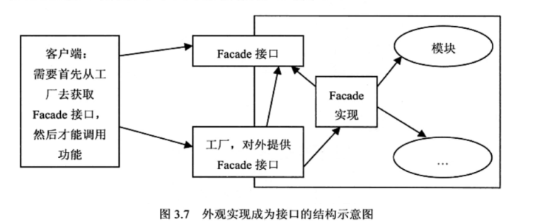

# 模式名称
外观模式(套餐)

# 环境和问题

**生活中的范例**

我们自己组装，需要了解各配件的性能与兼容性，对大部分客户不现实
    
    

另一个方案，找一家装机公司帮你组装，大部分客户的选择，这就是Facade

   

--- 

# 解决方案
外观模式就是引入一个外观类，在这个类里面定义客户端想要的简单方法，在这些方法的实现里面，由外观类再去分别
调用内部的多个模块来实现功能。

1. Facade:定义多个模块对外的高层接口，需要调用内部多个模块，把客户的请求代理给适当的子系统对象。
2. 模块:接受Facade对象的委派，真正实现功能，各个模块之间可能有交互。**但是Facade对象知道各个模块，但各个模块不知道Facade对象**。

# 模式详解
1. 目的：不是给子系统加新的功能接口，而是为了让外部减少与子系统内多个模块的交互，松散耦合，让外部简单使用子系统。(虽然这里可以定义新的
功能，但不要这么做)
2. 使用 or 不使用：使用外观实现从客户端转移至系统，节省系统的学习成本
3. 有外观，但是可以不使用：用户可以自行选择是否使用外观
4. 外观提供缺省的功能实现
5. 外观模式的调用顺序

    
6. 外观模式的实现
    - 单例实现：当做静态方式，不需要创建外观实例而直接调用，一般是辅助工具类
    - 作为接口实现：增加复杂度，但可以有选择性地暴露接口的方法，尽量减少模块对子系统提供地接口方法
        
        
7. 外观模式的优点
    - 松散耦合：松散子系统与客户端的耦合关系
    - 简单易用
    - 更好的划分层次：哪些方法是对系统外的，哪些方法是对系统内部使用的。
8. 外观模式的缺点
    - 过多的外观模式使人迷惑

# 思考外观模式
1. 外观的本质
    > 封装交互，简化调用
2. 对设计原则的体现：最少知识原则
3. 何时选用：
    - 复杂的子系统提供一个简单的接口，使用外观对象实现大部分客户的需求
    - 让客户程序和抽象类解耦合
    - 构建多层结构系统，外观对象作为每层的入口。
    
# 相关模式
**外观模式与中介者模式：**

**外观模式与单例模式：**
- 子系统只需要一个实例，可以与单例模式把外观类实现成单例

**外观模式与抽象工厂：**
- 外观类通过抽象工厂获取子系统接口，外观类获取功能并不知道内部的具体实现。