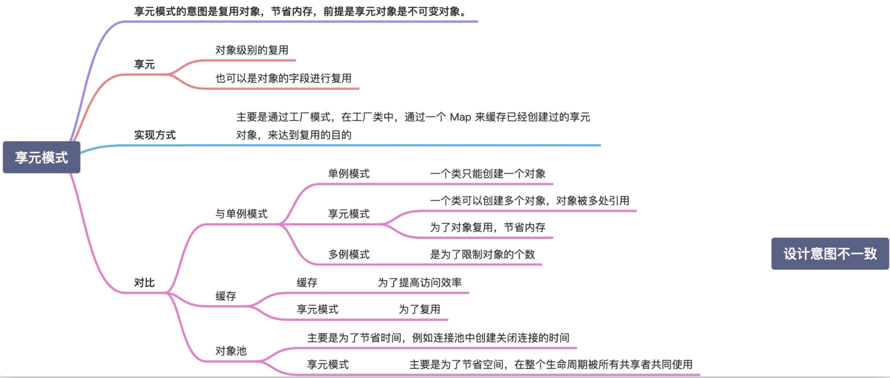

# 享元模式
  

  

所谓“享元”，顾名思义就是被共享的单元。享元模式的意图是复用对象，节省内存，前提是享元对象是不可变对象。

具体来讲，当一个系统中存在大量重复对象的时候，如果这些重复的对象是不可变对象，我们就可以利用享元模式将对象设计成享元，在内存中只保留一份实例，供多处代码引用。这样可以减少内存中对象的数量，起到节省内存的目的。实际上，不仅仅相同对象可以设计成享元，对于相似对象，我们也可以将这些对象中相同的部分（字段）提取出来，设计成享元，让这些大量相似对象引用这些享元。

这里我稍微解释一下，定义中的“不可变对象”指的是，一旦通过构造函数初始化完成之后，它的状态（对象的成员变量或者属性）就不会再被修改了。所以，不可变对象不能暴露任何 set() 等修改内部状态的方法。之所以要求享元是不可变对象，那是因为它会被多处代码共享使用，避免一处代码对享元进行了修改，影响到其他使用它的代码。