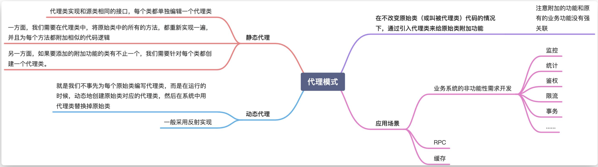
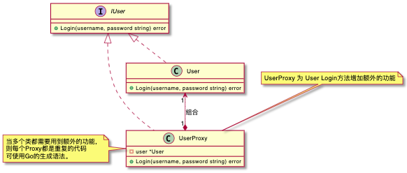

- [简述](#简述)
- [代理模式](#代理模式)
  - [代理模式解释](#代理模式解释)
  - [动态代理模式解释](#动态代理模式解释)
  - [代理模式的应用场景](#代理模式的应用场景)

# 简述

  

  

接下来会通过 golang 实现静态代理，有 Golang 和 java 的差异性，我们无法比较方便的利用反射实现动态代理，但是我们可以利用 go generate 实现类似的效果，并且这样实现有两个比较大的好处，一个是有静态代码检查，我们在编译期间就可以及早发现问题，第二个是性能会更好。

# 代理模式
代理模式（Proxy Design Pattern）的原理和代码实现都不难掌握。它在不改变原始类（或叫被代理类）代码的情况下，通过引入代理类来给原始类附加功能。我们通过一个简单的例子来解释一下这段话。

Python的装饰器@感觉与代理模式不谋而合。

## 代理模式解释
代理模式的使用：
- 对于内部类的扩展，Proxy Class可以实现相同的接口，在原始类上套上Proxy，类似于Middleware
- 对于外部类的扩展，一般使用继承的方式。让Proxy Class继承原始类，重写需要改写的功能。

## 动态代理模式解释
所谓动态代理（Dynamic Proxy），就是我们不事先为每个原始类编写代理类，而是在运行的时候，动态地创建原始类对应的代理类，然后在系统中用代理类替换掉原始类。那如何实现动态代理呢？

此功能Python的装饰器已经完美实现，装饰函数赋予函数统计信息的能力。

## 代理模式的应用场景
1. 业务系统的非功能性需求开发：代理模式最常用的一个应用场景就是，在业务系统中开发一些非功能性需求，比如：监控、统计、鉴权、限流、事务、幂等、日志。我们将这些附加功能与业务功能解耦，放到代理类中统一处理，让程序员只需要关注业务方面的开发。实际上，前面举的搜集接口请求信息的例子，就是这个应用场景的一个典型例子。
2. 代理模式在 RPC、缓存中的应用：实际上，RPC 框架也可以看作一种代理模式，GoF 的《设计模式》一书中把它称作远程代理。通过远程代理，将网络通信、数据编解码等细节隐藏起来。客户端在使用 RPC 服务的时候，就像使用本地函数一样，无需了解跟服务器交互的细节。除此之外，RPC 服务的开发者也只需要开发业务逻辑，就像开发本地使用的函数一样，不需要关注跟客户端的交互细节。
