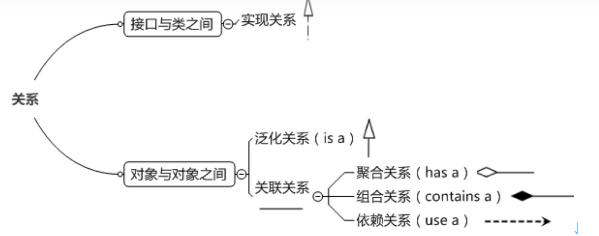
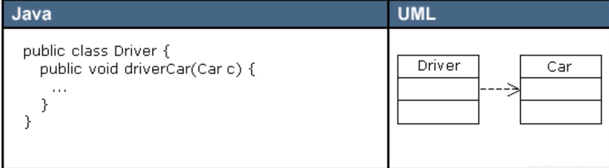
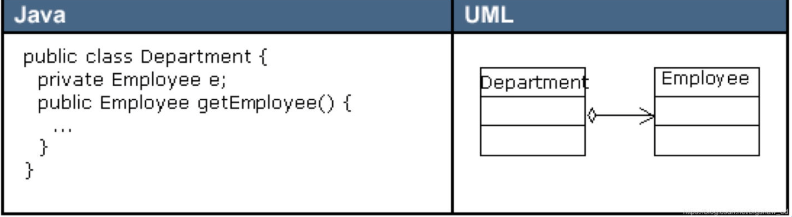
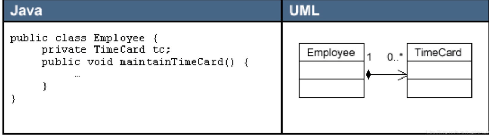

- [UML简介](#uml简介)
- [一 类图](#一-类图)
  - [1.1 类图中具体类、抽象、接口和包的表示法](#11-类图中具体类抽象接口和包的表示法)
    - [1.1.1 在UML类图中表示具体类](#111-在uml类图中表示具体类)
    - [1.1.2 在UML类图中表示抽象类](#112-在uml类图中表示抽象类)
    - [1.1.3 在UML类图中表示接口](#113-在uml类图中表示接口)
  - [1.2 在类图中表示关系](#12-在类图中表示关系)
    - [1.2.1 实现关系](#121-实现关系)
    - [1.2.2 泛化关系](#122-泛化关系)
    - [1.2.3 关联关系](#123-关联关系)
      - [1.2.3.1 依赖关联](#1231-依赖关联)
      - [1.2.3.2 聚合关联](#1232-聚合关联)
      - [1.2.3.3 组合](#1233-组合)

# UML简介
# 一 类图 
## 1.1 类图中具体类、抽象、接口和包的表示法
### 1.1.1 在UML类图中表示具体类
具体类在类图中用矩形框表示，矩形框分为三层：第一层是类名字。第二层是类的成员变量；第三层是类的方法。成员变量以及方法前的访问修饰符用符号来表示：
- “+”表示 public；
- “-”表示 private；
- “#”表示 protected；
- 不带符号表示 default。

### 1.1.2 在UML类图中表示抽象类
抽象类在UML类图中同样用矩形框表示，但是抽象类的类名以及**抽象方法的名字都用斜体字**表示

### 1.1.3 在UML类图中表示接口
接口在类图中也是用矩形框表示，但是与类的表示法不同的是，接口在类图中的第一层顶端用构造型 <<interface>>表示，下面是接口的名字，第二层是方法

## 1.2 在类图中表示关系
 

### 1.2.1 实现关系
实现关系用空心三角和虚线组成的箭头来表示，**从实现类指向接口**

### 1.2.2 泛化关系
泛化关系（Generalization）是指对象与对象之间的继承关系。如果对象A和对象B之间的“is a”关系成立，那么二者之间就存在继承关系，对象B是父对象，对象A是子对象

### 1.2.3 关联关系
关联关系（Association）是指对象和对象之间的连接，它使一个对象知道另一个对象的属性和方法。也就是说，如果一个对象的类代码中，包含有另一个对象的引用，那么这两个对象之间就是关联关系。

**双向关联/单向关联：**
在UML图中，双向关联关系用带双箭头的实线或者无箭头的实线双线表示。单向关联用一个带箭头的实线表示，箭头指向被关联的对象。

**多重性：**
一个对象可以持有其它对象的数组或者集合。在UML中，通过放置多重性（multipicity）表达式在关联线的末端来表示。多重性表达式可以是一个数字、一段范围或者是它们的组合。多重性允许的表达式示例如下：
- 数字：精确的数量
- `*`或者`0..*`：表示0到多个
- `0..1`：表示0或者1个，在Java中经常用一个空引用来实现
- `1..*`：表示1到多个

**关联关系又分为依赖关联、聚合关联和组合关联三种类型。**

#### 1.2.3.1 依赖关联
依赖（Dependency）关系是一种弱关联关系。如果对象A用到对象B，但是和B的关系不是太明显的时候，就可以把这种关系看作是依赖关系。

🌰：如果对象A依赖于对象B，则 A “use a” B。比如驾驶员和汽车的关系，驾驶员使用汽车，二者之间就是依赖关系。

在UML类图中，**依赖关系用一个带虚线的箭头表示**，由使用方指向被使用方，表示使用方对象持有被使用方对象的引用
  

*依赖关系在Java中的具体代码表现形式为B为A*：
- 构造器
- 方法中的局部变量
- 方法或构造器的参数
- 方法的返回值
- A调用B的静态方法

#### 1.2.3.2 聚合关联
聚合（Aggregation）是关联关系的一种特例，它体现的是整体与部分的拥有关系，即 “has a” 的关系。

此时整体与部分之间是可分离的，它们可以具有各自的生命周期，部分可以属于多个整体对象，也可以为多个整体对象共享，所以聚合关系也常称为共享关系。

🌰：公司部门与员工的关系，一个员工可以属于多个部门，一个部门撤消了，员工可以转到其它部门。

在UML图中，**聚合关系用空心菱形加实线箭头表示，空心菱形在整体一方，箭头指向部分一方**。
  

---

#### 1.2.3.3 组合
组合（Composition）也是关联关系的一种特例，它同样体现整体与部分间的包含关系，即 “contains a” 的关系。**但此时整体与部分是不可分的，部分也不能给其它整体共享，作为整体的对象负责部分的对象的生命周期。这种关系比聚合更强，也称为强聚合**。如果A组合B，则A需要知道B的生存周期，即可能A负责生成或者释放B，或者A通过某种途径知道B的生成和释放。

🌰：人包含头、躯干、四肢，它们的生命周期一致。当人出生时，头、躯干、四肢同时诞生。当人死亡时，作为人体组成部分的头、躯干、四肢同时死亡。

在UML图中，组合关系用实心菱形加实线箭头表示，实心菱形在整体一方，箭头指向部分一方。
  

**从业务角度上来看，如果作为整体的对象必须要部分对象的参与，才能完成自己的职责，那么二者之间就是组合关系，否则就是聚合关系。**