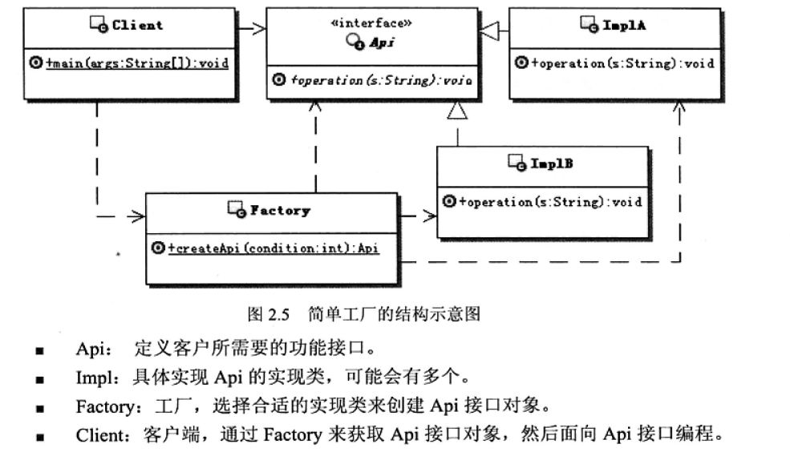
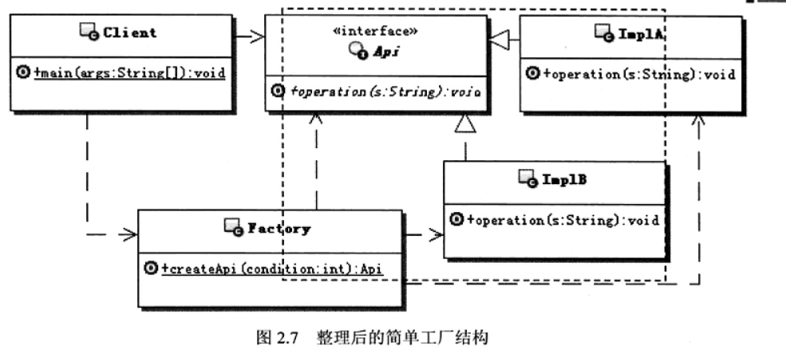

# README

## 模式名称

简单工厂函数

## 环境和问题

**环境：**

**问题：**

* 客户端 **出现了只知道接口而不知实现的情况**，若使用Impl类实现就使用了具体的实现这**违背封装隔离**

## 解决方案

**简单工厂函数的定义：**

* 提供一个创建对象实例的功能，而无须关心具体的实现。被创建实例的类型可以是接口，抽象类，也可以是具体的类。

**实现：**

* 模块内部实现一个类，在类中创建接口，创建的接口返回给客户端，外部只需要用该类获取接口对象

  

## 模式详解

> **理解这个问题的关键在于理解简单工厂的边界**

**简单工厂的边界：**

* 接口，实现类，工厂类组成了一个组件，工厂函数和接口外部可以看到，但具体类是不对外的

  

简单工厂的功能：

* 创造东西。如接口，抽象类，类实例

静态工厂：

* 工厂的方式是静态的，也就是静态工厂，防止无意义的创建多个实例，还可以把构造方式私有化

万能工厂:

* 包含多个构造东西的方法

简单工厂的创建范围：

* 不要太多，控制在一个独立的组件级别或者一个模块级别

简单工厂调用顺序示意图：

简单工厂的命名：

* 类名称模块名称+Factory
* 方法名 "get+接口名" 或 "new+接口名" 

**优缺点**：

* 优点
  * 帮助封装：让组件外部使用接口编程
  * 解耦：通过简单工厂，实现客户端和具体实现类的解耦
* 缺点
  * 增加了客户端的复杂度：客户端需要理解个参数的具体含义和功能，依然暴露了内部实现
  * 不方便扩展子工厂：

**本质：**

> 简单工厂的核心在选择实现。客户端选择相应实现，使客户端与实现解耦。实现代码改变不需要更改客户端代码

**何时选用简单工厂** 1. 完全封装，隔离具体实现，外部只能通过接口来操作封装体 2. 对外创建对象的职责集中控制和管理。

简单工厂与抽象工厂模式

* 简单工厂用来选择实现，可以任意接口的实现
* 抽象工厂用来选择产品簇的实现，创建的对象构成一个产品簇所需要的部件对象

简单工厂与工厂方式模式

* 工厂方法都是用来选择实现的
* 区别在于工厂方式模式把具体实现，延迟到子类中实现

简单工厂与创建对象的模式

* 简单工厂为选择实现，与任何具体的创建对象实例的模式配合使用，如：单例模式，原型模型，生成器模式等。

