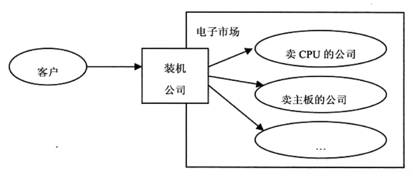
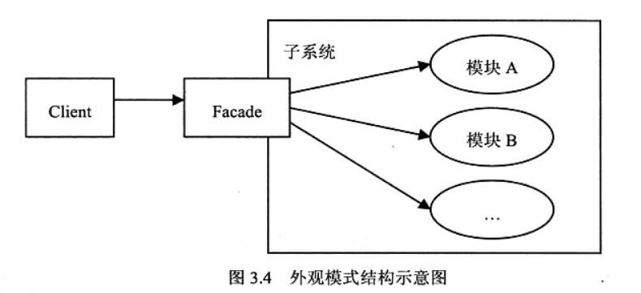

# README

## 模式名称

外观模式

## 环境和问题

**生活中的范例**

我们自己组装，需要了解各配件的性能与兼容性，对大部分客户不现实

另一个方案，找一家装机公司帮你组装，大部分客户的选择，这就是Facade

## 解决方案

外观模式就是引入一个外观类，在这个类里面定义客户端想要的简单方法，在这些方法的实现里面，由外观类再去分别 调用内部的多个模块来实现功能。

 1. Facade:定义多个模块对外的高层接口，需要调用内部多个模块，把客户的请求代理给适当的子系统对象。 2. 模块:接受Facade对象的委派，真正实现功能，各个模块之间可能有交互。**但是Facade对象知道各个模块，但各个模块不知道Facade对象**。

## 模式详解

